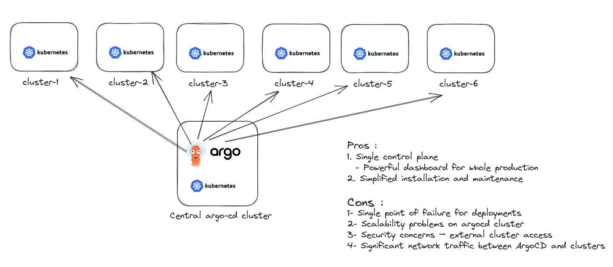

## Argo CD Multi-Cluster Architectures 

### 1. The Management Cluster Model

### 2. The Per-Cluster Model

### 3. ArgoCD per Organization

### 4. ArgoCD Managing more ARGOCDs

### Resources:
1. [ArgoCon '21 - Argo CD Production Best Practices (Alexander Matyushentsev)](https://www.youtube.com/watch?v=ESQLqjbM8h0&t=679s)
2. [Control Plane, Service, or Both? – Argo CD Multi-Cluster Architectures - Nicholas Morey, Akuity](https://www.youtube.com/watch?v=vyaZv4yM3_o)